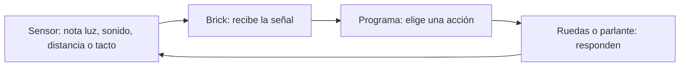

# Taller de robots LEGO NXT (40 minutos)

Cada grupo arma **un robot pequeño** y lo prueba. Los programas **ya están cargados en los bricks**: durante el taller no hay que escribir código ni usar computador.

## Antes de que lleguen los niños

- Preparen un kit por grupo: brick NXT con pilas, dos motores, dos ruedas, una ruedita o patín de apoyo, cables y los sensores de su robot.
- Comprueben que el brick tenga el programa correcto: `cucaracha`, `palmadas` o `perrito`.
- Dejen una zona despejada **en el suelo** para las pruebas y una linterna para la cucaracha.

## Qué hará cada robot

| Robot | Sensores que debe tener | Qué pasa al probarlo |
| --- | --- | --- |
| **Cucaracha** | Luz arriba (**puerto 3**) y distancia mirando al frente (**puerto 4**) | En sombra se queda quieta. Con linterna huye; si encuentra algo delante, gira. |
| **Palmadas** | Sonido sin tapar el micrófono (**puerto 2**) | Una palmada la hace bailar. Otra palmada la detiene. |
| **Perrito** | Distancia mirando al frente (**puerto 4**) y botón de tacto accesible arriba (**puerto 2**) | Si detecta a alguien, se acerca. Al estar cerca se detiene y pide caricias. Al pulsar el botón, se menea. |

En los tres robots, conecten el **motor de la rueda izquierda al puerto B** y el **de la derecha al puerto C**.

## Cómo usar los 40 minutos

| Tiempo | Qué hace cada grupo |
| --- | --- |
| **0–5 min** | Entregar a cada grupo el kit de su robot y mostrar dónde se conectan motores y sensores. |
| **5–30 min** | Armar la base y conectar los sensores según la tabla. **Apenas un grupo termine, lleva su robot al suelo y lo prueba**; no necesita esperar a los demás. |
| **30–40 min** | Continuar las pruebas y ayudar a los grupos cuyo robot todavía no responde. |

**Para iniciar:** en el brick, ir a **My Files → Software Files → nombre del robot → Run**. Para detenerlo, pulsar el botón gris **Atrás**. Un monitor puede ayudar a encontrar el programa; los niños se concentran en armar y probar.

## Pruebas rápidas

### Cucaracha

1. Tapar el sensor de luz: debería quedarse quieta.
2. Alumbrarlo con la linterna: debería moverse en zigzag.
3. Poner una caja delante mientras está alumbrada: debería girar para esquivarla.

**Explicación en una frase:** «Si ve luz, se escapa; si ve una pared, gira».

### Palmadas

1. Dejar el lugar lo más silencioso posible.
2. Dar una palmada fuerte cerca del sensor: debería bailar.
3. Esperar un momento y dar otra palmada **durante una pausa de la música**: debería parar.

**Explicación en una frase:** «Cada palmada cambia entre bailar y estar quieto».

### Perrito

1. Poner una mano delante, a unos **40–50 cm**: debería acercarse.
2. Acercar la mano a unos **25 cm**: debería detenerse y ladrar.
3. Pulsar el botón de tacto: debería menearse.

**Explicación en una frase:** «Si te ve, se acerca; si estás cerca, pide caricias».

## Cómo explicar el programa con bloques

Esta sección es para los monitores. Si un niño pregunta cómo funciona, basta con decir: **«El sensor nota algo, se lo cuenta al brick y el brick decide qué hacen las ruedas o el sonido»**. Esto ocurre una y otra vez mientras el programa está encendido.



El sensor **no reconoce** por sí solo una «palmada», una «pared» o una «persona»: entrega una señal y el programa la interpreta.

| Sensor | Qué le avisa al brick |
| --- | --- |
| Luz | Si recibe mucha o poca luz. |
| Sonido | Si oye un ruido fuerte o suave. |
| Distancia | Envía un sonido que rebota y detecta si hay algo cerca. |
| Tacto | Si presionaron el botón. |

Los bloques de cada robot, en palabras sencillas:

**Cucaracha**

```text
REPETIR
  SI está oscuro → quedarse quieta
  SI hay luz:
    SI hay pared delante → girar
    SI no hay pared → huir en zigzag
```

**Palmadas**

```text
REPETIR
  ESCUCHAR el sensor de sonido
  SI oye una palmada:
    SI estaba quieto → empezar a bailar
    SI estaba bailando → detenerse
```

**Perrito**

```text
REPETIR
  SI no ve a nadie → esperar
  SI ve a alguien a distancia → acercarse
  SI alguien está muy cerca → parar y pedir caricias
    SI lo tocan → menearse
```

Para explicarlo en vivo, muestren el sensor correspondiente y hagan **una prueba**: alumbrar, aplaudir o acercar la mano. El diagrama y los bloques son un apoyo para ustedes; los niños pueden entender la idea viendo la respuesta del robot.

## Si algo no responde

1. Revisar que esté abierto el programa del robot correcto.
2. Revisar los cables: motores **B/C** y sensores en los puertos de la tabla.
3. Comprobar que el sensor mire hacia donde se hace la prueba y que las pilas tengan carga.
4. Probar de nuevo con el robot en el suelo y espacio libre. Para palmadas, esperar una pausa de la música antes de la segunda.

## Para los compañeros que quieran leer el código

Los archivos [cucaracha.py](cucaracha.py), [palmadas.py](palmadas.py) y [perrito.py](perrito.py) están comentados. La idea de los tres es la misma: **el sensor detecta algo → el robot decide → mueve las ruedas o hace un sonido → vuelve a mirar**. En Python, `if` significa «si», `else` significa «si no» y `while True` significa «repetir».

Los archivos [cucaracha.nxc](cucaracha.nxc), [palmadas.nxc](palmadas.nxc) y [perrito.nxc](perrito.nxc) son las versiones del brick. Los Python son para estudiarlos o demostrarlos con USB; **no hacen falta para el taller**. Si alguien quiere ejecutarlos después en un computador, necesitará Python 3, [requirements.txt](requirements.txt) y un NXT conectado por USB.
