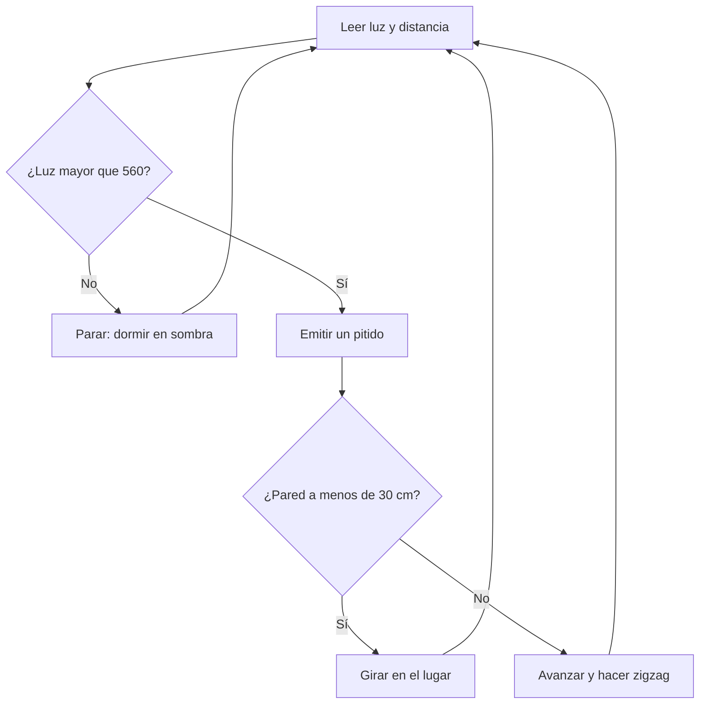
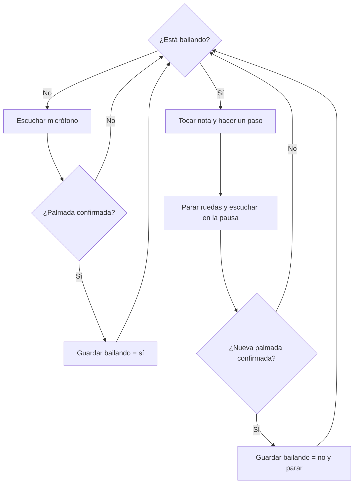
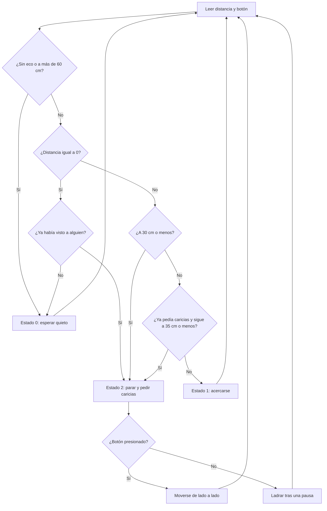

# Taller de robots LEGO NXT: cucaracha, palmadas y perrito

Esta guía acompaña a [cucaracha.py](cucaracha.py), [palmadas.py](palmadas.py) y [perrito.py](perrito.py). Los archivos Python están comentados para estudiar la lógica y hacer demostraciones con el NXT conectado por USB. Los correspondientes [cucaracha.nxc](cucaracha.nxc), [palmadas.nxc](palmadas.nxc) y [perrito.nxc](perrito.nxc) se compilan a `.rxe` para ejecutarlos directamente en el brick. Comparten la idea de cada robot, pero no todos los detalles son iguales.

## Archivos y ejecución

| Robot | Para estudiar en Python | Para compilar en el brick |
| --- | --- | --- |
| Cucaracha | `cucaracha.py` | `cucaracha.nxc` |
| Palmadas | `palmadas.py` | `palmadas.nxc` |
| Perrito | `perrito.py` | `perrito.nxc` |

Los Python requieren un NXT conectado por USB, Python 3 y las dependencias de [requirements.txt](requirements.txt). [nxt_usb_patch.py](nxt_usb_patch.py) acompaña a esos archivos para la conexión USB en macOS. Para instalar y ejecutar una demostración:

```bash
python3 -m venv .venv
source .venv/bin/activate
python -m pip install -r requirements.txt
python cucaracha.py  # o palmadas.py / perrito.py
```

En Windows se activa el entorno con `.venv\Scripts\activate`. Ejecuten **solo un Python a la vez**. Los `.nxc` se incluyen como referencia del programa del brick; para compilar y subirlos hace falta un compilador NXC y una herramienta de transferencia NXT, que no forman parte de este repositorio. El README de abajo explica los Python y señala sus diferencias con los `.nxc`.

## La idea común

Un robot repite cuatro acciones: **sentir → decidir → actuar → volver a sentir**. En Python, `while True` significa «repetir siempre»; `if` significa «si pasa esto»; `else` significa «si no»; y `time.sleep(...)` significa «esperar un momento». Las variables como `estado` guardan algo que el robot debe recordar entre una vuelta y la siguiente.

| Pieza | Para explicarla a niños | En estos programas |
| --- | --- | --- |
| Sensor | Los «ojos», «oídos» o «piel» | Luz, sonido, distancia o botón |
| Umbral | La línea que separa dos decisiones | `UMBRAL_LUZ`, `UMBRAL`, `MIMOS` |
| Condición | Una pregunta que se responde sí o no | `if luz <= UMBRAL_LUZ` |
| Motor | Las piernas o ruedas | `left.run(...)`, `right.run(...)` |
| Estado | La memoria de lo que está haciendo | `bailando`, `estado` |

**Antes de mostrarlo:** verifiquen los puertos de sensores y motores. Levanten las ruedas al probar la dirección: en este chasis, potencia **negativa** de ambos motores significa avanzar (equivale a `OnRev` en NXC). Los sensores de luz y sonido entregan valores crudos inversos en `nxt-python`; los `.py` calculan `1023 - lectura` para que más luz o más ruido produzcan un número mayor. Los umbrales se ajustan mirando las muestras que imprime cada programa. Con `Ctrl+C` se detienen las demostraciones Python.

La inversión se puede contrastar con el [tutorial de NXC para el sensor de luz](https://bricxcc.sourceforge.net/nbc/nxcdoc/NXC_tutorial.pdf) y la [descripción del valor crudo del sensor de sonido NXT](https://www.mathworks.com/help/simulink/supportpkg/legomindstormsev3_ref/nxtsoundsensor.html). Los números exactos cambian con el ambiente.

## 1. Cucaracha: «si me alumbras, huyo»

**Entradas:** luz en puerto 3, ultrasonido en puerto 4. **Salidas:** motores B y C, y sonido. `UMBRAL_LUZ = 560` separa sombra y linterna; `PARED_CM = 30` define cuándo esquivar una pared.



**Bloques en lenguaje cotidiano:**

```text
REPETIR SIEMPRE
  MIRAR cuánta luz hay
  MIRAR qué tan cerca está la pared
  SI está oscuro
    DETENER las ruedas
  SI NO
    HACER un sonido
    SI hay pared cerca
      GIRAR
    SI NO
      AVANZAR y CURVARSE a un lado al azar
```

**Para el equipo:** `d = 255` significa que el sensor ultrasónico no devolvió un eco útil; este Python lo trata como camino libre. El zigzag no es un sensor nuevo: sale de mover una rueda más rápido que la otra. Pregunta para niños: «¿Qué hará si ponemos la linterna y una caja delante al mismo tiempo?». Respuesta: girará primero.

## 2. Palmadas: «una para bailar, otra para parar»

**Entrada:** sensor de sonido en puerto 2. **Salidas:** motores B y C, y altavoz. `bailando` es su memoria de encendido/apagado. Para reconocer una palmada pide **dos lecturas fuertes seguidas**. `armado` impide que el mismo ruido cuente dos veces: el sonido debe bajar de `REARME` antes de aceptar otra palmada.



**Bloques en lenguaje cotidiano:**

```text
EMPEZAR en modo ESPERA
REPETIR SIEMPRE
  SI estoy esperando Y oigo una palmada confirmada
    CAMBIAR a modo BAILE
  SI estoy bailando
    TOCAR una nota y HACER un paso
    PARAR un instante para escuchar
    SI oigo otra palmada confirmada
      CAMBIAR a modo ESPERA y DETENER las ruedas
```

**Para el equipo:** los cuatro movimientos se repiten: avanzar, girar, retroceder, girar al otro lado. En Python la melodía es corta y la escucha ocurre en las pausas; una palmada durante un paso puede no detectarse. El `.nxc` toca un estribillo más largo y tiene un período inicial en que ignora el micrófono para evitar el eco de la primera palmada. Pregunta para niños: «¿Por qué debe haber un pequeño silencio antes de la segunda palmada?». Respuesta: para distinguirla de la primera.

## 3. Perrito: «me acerco y pido caricias»

**Entradas:** ultrasonido en puerto 4, tacto en puerto 2. **Salidas:** motores B y C, y altavoz. El robot recuerda tres estados: **0 espero**, **1 me acerco**, **2 pido caricias**.



**Bloques en lenguaje cotidiano:**

```text
REPETIR SIEMPRE
  MIRAR la distancia y el botón de caricias
  SI no veo a nadie o está muy lejos
    ESPERAR quieto
  SI NO, SI está a una distancia intermedia
    ACERCARME
  SI NO
    PARAR y PEDIR caricias
    SI me tocan, HACER un meneo
    SI no me tocan, LADRAR después de una pausa
```

**Para el equipo:** hay una franja especial entre 31 y 35 cm: si el perrito ya pedía caricias, sigue pidiéndolas hasta que la persona se aleje más de 35 cm. Eso evita cambiar de estado una y otra vez por pequeñas variaciones del sensor. `255` significa sin eco y hace que espere. La lectura `0` solo se interpreta como «muy cerca» si ya había visto a alguien. En este Python, dejar el botón apretado puede repetir el meneo; el `.nxc` cuenta solo una pulsación nueva y confirma que alguien se alejó tras tres lecturas.

## Cómo usarlo en el taller

1. Hagan que los niños representen los bloques con el cuerpo: uno es sensor, otro decide y dos son las ruedas.
2. Predigan qué hará el robot **antes** de encenderlo: sombra/luz, silencio/palmada, lejos/cerca/toque.
3. Prueben una condición por vez y comparen con la predicción. Si no responde, miren primero la lectura del sensor y ajusten el umbral.

Para estudiar el código, lean en cada `.py` en este orden: **constantes → sensores y motores → funciones de movimiento → `while True` → `if`/`else`**. Las funciones (`dormir`, `es_palmada`, `meneito`) son acciones con nombre: ayudan a que el ciclo principal se lea como una historia.
